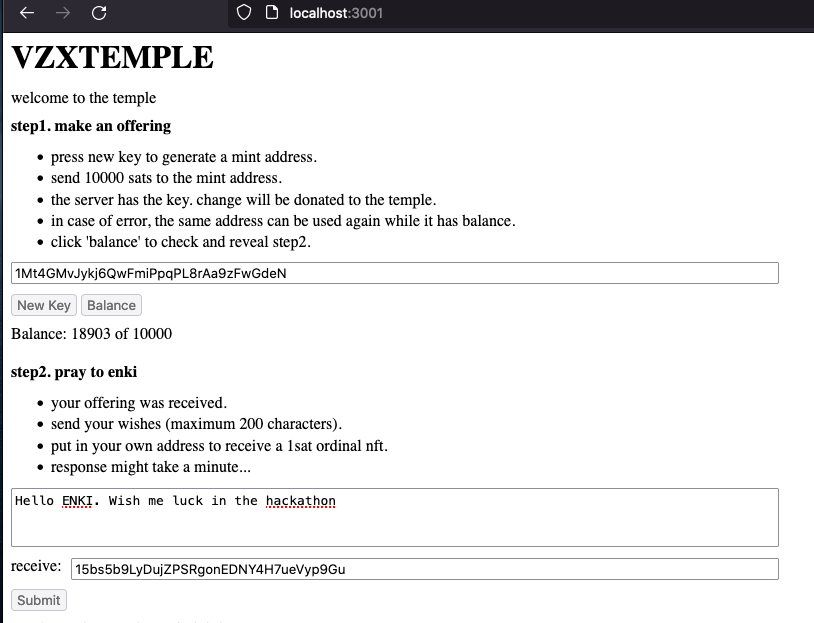
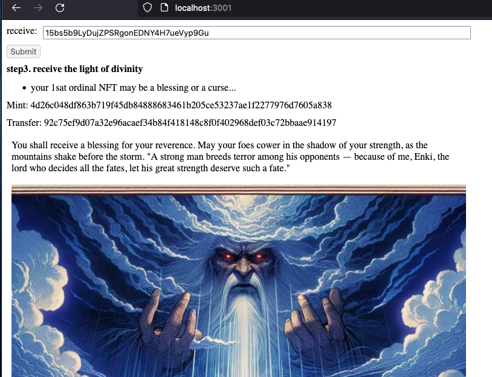

# VZXTEMPLE

*by Tim Middleton*

Demo Video: [hackthon video](https://vimeo.com/936882508?share=copy)  
Hackathon Entry: [Entry](https://devfolio.co/projects/vzxtemple-5e9e)  

For this hackathon I created a digital temple. 
It uses generative AI to simulate a theophany and records it as a 1sat ordinal on the BSV blockchain.  

Visitors to the temple may make an offering and a prayer.  
In return, they receive divine light from the god ENKI.  

### Usage

Run the webserver like so

```
> node app.js main.config.json
```

### config

The first argument to app.js is a path to a json config file:

```
{
    // open ai configuration
    "apikey": "open ai api key",
    "assistant_id": "open ai assistant id",
    "vectorstore_id" "open ai vector store id",
    // all data written into this directory
    "datapath": "/path/for/datastorage",

    // bsv network description
    "network": "mainnet",
    
    // minimum amount for the offering. set it based on open ai costs
    "minOfferingSats": 10000,
    
    // the port number to run server on
    "port": 3001
}
```

### Screenshot

  



### Todos

- Add tool to sweep all the used mint keys
- Lock mint key to run id
- Replace TestWallet with something else
- Better interface
- Add other gods, for example Jesus or South American gods
- Other things to do at the temple...
